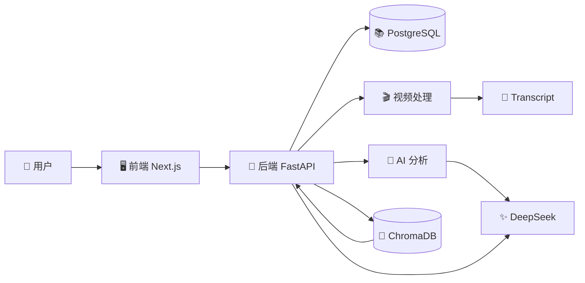

# 🎓 VideoMind AI：从视频收藏到 AI 知识库

这是一份可以单独阅读的课程。你不需要点击其他文件，也不需要已经懂编程。

课程结合了当前项目代码、项目文档、Git 记录，以及我们在本次聊天中讨论过的设计过程。目前项目已跑通前端、后端、视频处理、AI 分析和 RAG 的基础结构，但生产部署、正式认证、可靠任务队列和数据库迁移还没有完成。

## 🧭 截止目前的学习地图

```text
用户问题
→ 产品目标
→ 前端与后端分工
→ 视频下载与字幕处理
→ AI 结构化分析
→ PostgreSQL 保存业务数据
→ ChromaDB 建立语义检索
→ RAG 基于视频资料回答
→ 测试与部署审计
→ 下一阶段生产化
```

这条路线既是 VideoMind AI 的系统流程，也是你学习 AI 工程项目的一条路径。

## 💡 我们正在做什么？

很多人收藏了视频，却没有时间完整观看，更不会定期回顾。VideoMind AI 希望把这些视频变成可以搜索、阅读和提问的个人知识。

用户提交一个视频链接，系统尝试获取视频和字幕。如果没有字幕，系统可以提取音频并交给语音识别。得到文字后，大语言模型会生成摘要、核心观点、关键词、时间线和行动建议。最后，这些内容进入个人知识库，用户可以问：“我的收藏中有哪些视频讨论过 AI Agent 商业化？”

这里实际上有两条流水线。

### 流水线一：把视频变成知识

```text
视频链接
→ 下载视频与字幕
→ 字幕清洗或音频转写
→ Transcript 原始文字
→ AI 结构化分析
→ Summary 和 Markdown 笔记
→ 写入知识库
```

### 流水线二：从知识中回答问题

```text
用户问题
→ 把问题转换成向量
→ 搜索相似视频资料
→ 把资料交给大语言模型
→ 生成中文回答
→ 展示来源视频
```

## 🏗️ 系统是怎样运转的？



### 🖥️ 前端（Frontend）：和用户交流

前端是用户看到的页面，包括首页、工作台、视频知识库、视频详情和聊天页面。

它接收视频链接、标签和聊天问题，把这些输入转换成 API 请求。后端返回视频状态、摘要或聊天回答后，前端再把 JSON 数据显示成卡片、列表和消息。

前端不直接下载视频，也不直接访问数据库。它的职责是让复杂能力变得容易操作。项目使用 React 组件管理表单和交互，Next.js 管理页面、路由和服务器端数据读取，TypeScript 尽量提前发现数据类型错误。

### 🚪 后端（Backend）：协调所有业务

后端是整个系统的交通指挥中心。FastAPI 根据 URL 和 HTTP 方法找到对应路由，Pydantic 检查输入是否符合格式，service（服务层）执行实际业务，SQLAlchemy 负责读写数据库。

以提交视频为例：后端接收 JSON，检查 URL 和字段，取得当前用户，创建 Video 记录，再把结构化结果返回前端。

把路由和 service 分开很重要。路由关心“网络请求怎样进来”，service 关心“业务应该怎样执行”。未来增加 CLI、任务队列或新界面时，可以复用同一套业务逻辑。

### 📚 PostgreSQL：保存业务事实

PostgreSQL 保存用户、视频、处理状态、Transcript、Summary 和向量记录 ID。

它适合回答有明确关系的问题：这条视频属于谁？现在是什么状态？摘要属于哪条视频？这个用户最近有哪些视频？SQLAlchemy ORM 把这些数据库表映射成 Python 类。

项目当前使用 `create_all` 和开发期 schema 补丁保持数据库可运行，但生产环境还需要 Alembic migration，才能记录数据库结构的每一次升级和回滚。

### 🎬 视频处理：把媒体变成文字

系统首先使用 yt-dlp 下载视频和字幕。找到 VTT 或 SRT 字幕时，会删除时间戳、标签和重复行，直接得到 transcript。

没有字幕时，ffmpeg 从视频中提取音频，ASR 再把音频变成文字。当前 ASR 默认关闭，所以无字幕视频可能无法继续完成处理。

任务暂时使用 FastAPI BackgroundTasks。用户可以快速收到“任务已启动”，但任务仍属于 API 进程；如果进程重启，缺少持久队列保护。这适合 MVP，不适合可靠的生产长任务。

### 🧠 AI 分析：把文字变成结构化知识

Transcript 是原始文字，不等于容易学习的笔记。LangGraph 组织两个步骤：

1. analysis 节点把 transcript 交给 DeepSeek，要求返回 JSON。
2. markdown 节点把验证后的 JSON 转换成 Markdown 笔记。

中间使用 Pydantic 检查标题、摘要、关键词、时间线等字段。这样可以避免模型输出格式突然变化时，把错误结构直接写入数据库。

项目导入的是 OpenAI Python SDK，但默认连接 DeepSeek。SDK 是兼容客户端，不等于模型提供商一定是 OpenAI。

### 🔎 ChromaDB 与 RAG：让知识可以被重新找到

PostgreSQL 擅长准确查询，却不擅长判断两句话在含义上是否相近。项目因此增加 embedding 和 ChromaDB。

Embedding 把文本转换成数字向量，ChromaDB 在向量空间中寻找相近内容。RAG 的完整含义是 Retrieval-Augmented Generation，中文通常叫“检索增强生成”：先搜索资料，再把资料交给大语言模型回答。

当前 embedding 是本地 hash 算法，优点是免费、确定、容易运行；缺点是没有真正训练过语义理解，中文同义表达的召回能力有限。它更适合跑通系统闭环，而不是代表最终搜索质量。

## 🧰 技术与重要术语

### API（应用程序接口）

像餐厅的点菜单。前端按照菜单提交请求，后端按照约定返回结果。API 不是页面，也不是数据库。

### Route（路由）

像办事大厅的窗口编号。`POST /videos` 负责创建视频，`POST /chat` 负责聊天问题。

### ORM（对象关系映射）

像 Python 对象和数据库表之间的翻译员。开发者操作 Video 对象，SQLAlchemy 把操作转换成 SQL。

### Pipeline（流水线）

一组按顺序连接的处理步骤。前一步输出会成为后一步输入，例如视频 → 音频 → transcript。

### ASR（自动语音识别）

像听写员，把音频中的声音写成文字。它不负责总结内容，内容理解由 LLM 完成。

### LLM（大语言模型）

负责理解和生成语言。本项目使用它整理视频内容并生成 RAG 回答。

### Agent Workflow（Agent 工作流）

把 AI 任务拆成带状态的多个步骤。LangGraph 负责组织步骤，DeepSeek 负责实际语言推理。

### Embedding（向量表示）

像把每段文字放到一张“含义地图”上。含义越接近，坐标通常越靠近。

### Vector Database（向量数据库）

保存含义坐标并寻找最近邻居的数据库。本项目使用 ChromaDB。

### RAG（检索增强生成）

像开卷考试。模型先查用户的视频资料，再根据找到的资料回答，而不是完全依靠自身记忆。

### Background Task（后台任务）

响应返回后继续在应用进程中执行的工作。它不等于可靠的消息队列。

### Migration（数据库迁移）

数据库结构的版本历史。它让团队知道某个字段何时加入、怎样升级、怎样回退。

## 🧠 关键工程决策

### 为什么字幕优先？

因为已有字幕通常比重新做语音识别更快、更便宜。代价是字幕质量受视频平台影响。

### 为什么先生成 JSON，再生成 Markdown？

数据库需要稳定字段，模型的自然语言格式却不稳定。JSON 可以先经过 Pydantic 验证，Markdown 再由确定性代码生成。

### 为什么同时使用 PostgreSQL 和 ChromaDB？

它们解决的问题不同。PostgreSQL 保存业务关系和状态，ChromaDB 按内容相似度检索。一个负责“准确事实”，一个负责“语义邻近”。

### 为什么先做部署审计，而不是马上上线？

因为部署平台会影响数据库、向量库、视频处理、文件存储和任务队列。如果平台没选定就大改代码，很容易产生返工。

## 🧭 当前风险和未完成内容

- 前端 Dockerfile 使用 `next dev`，后端使用 `uvicorn --reload`，都偏向开发环境。
- 数据库还没有正式 Alembic migration。
- 视频长任务仍使用进程内 BackgroundTasks。
- 当前用户是 demo user，不是真实登录认证。
- ASR 默认关闭，无字幕视频支持有限。
- 本地 hash embedding 的中文语义质量有限。
- ChromaDB 的生产持久化方式尚未确定。
- 自动化测试目前主要覆盖健康检查，核心链路测试不足。

这些内容不代表项目失败。它们说明项目处于“基础闭环已经形成，正在准备生产化”的阶段。

## ✍️ 如果没有 AI，我可以怎样重做？

1. 先写清楚用户问题和最小成功流程。
2. 只实现创建和查询 Video 的 FastAPI API。
3. 用 PostgreSQL 保存 Video，并理解 ORM 和事务。
4. 加入 yt-dlp 和字幕解析，暂时不做 ASR。
5. 使用一段固定 transcript 测试 AI 结构化 JSON。
6. 把 JSON 转成 Markdown 并保存。
7. 实现本地 embedding 和 ChromaDB 检索。
8. 将检索结果加入 LLM prompt，完成 RAG。
9. 最后开发前端页面，把每个 API 动作接起来。
10. 补测试、migration、任务队列和生产部署。

每一步都先验证输入和输出，再进入下一步。这样即使没有 AI 一次性生成完整项目，你也能逐层建立系统。

## 🎤 自我检查

1. 前端和后端分别负责什么？
2. 为什么 Transcript 和 Summary 不是同一类数据？
3. OpenAI SDK 为什么可以连接 DeepSeek？
4. PostgreSQL 和 ChromaDB 为什么不能简单互相替代？
5. BackgroundTasks 在生产长任务中有什么风险？
6. hash embedding 跑通了什么，又牺牲了什么？
7. 如果没有字幕，当前系统会发生什么？
8. 为什么数据库生产化需要 migration？

## 💬 你可以继续问我

- “带我走一遍用户提交视频后的代码流程。”
- “用一个具体例子演示 RAG。”
- “解释 LangGraph 是否真的有必要。”
- “如果让我从零重做，陪我完成第一步。”
- “根据我们后续聊天继续更新这份课程。”

## 下一步

先尝试不看课程回答上面的八个问题。答不出来的部分，就是下一轮最值得继续提问和实践的内容。
