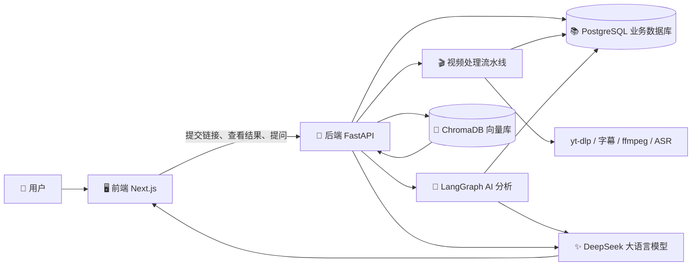

# 🗺️ VideoMind AI 架构地图


## 先看全局：系统像一间“视频知识加工厂”

你可以把 VideoMind AI 想成一间加工厂：用户送来视频，系统把视频加工成文字、笔记和可搜索的知识，最后允许用户向自己的知识库提问。



这张图中，前端负责“和人交流”，后端负责“协调工作”，PostgreSQL 负责“保存业务事实”，ChromaDB 负责“按内容相似度搜索”，视频工具负责“把视频变成文字”，大语言模型负责“理解和组织语言”。

## 🖥️ 前端（Frontend）：用户看到和操作的部分

### 它接收什么？

前端接收用户输入的视频链接、标题、标签和聊天问题，也接收后端返回的视频列表、处理状态、AI 摘要和引用来源。

### 它具体做什么？

- 首页介绍产品价值。
- Dashboard（工作台）展示视频数量、笔记数量和最近内容。
- Library（知识库）支持搜索和分类浏览。
- Video Detail（视频详情）展示摘要、关键词和操作按钮。
- Chat（问答页）让用户向视频知识库提问。
- `frontend/lib/api.ts` 把所有 HTTP 请求集中在一个地方，页面不需要各自重复拼接 URL 和处理错误。

### 它输出什么？

它把用户操作转换成 HTTP 请求，再把返回的 JSON 数据渲染成人能理解的页面。它本身不下载视频、不连接数据库，也不直接处理 AI 逻辑。

### 为什么需要这一层？

如果没有前端，用户只能用命令行或 API 工具操作系统。前端把复杂能力包装成“提交、处理、分析、写入知识库、提问”几个清晰动作。

### 失败时用户会看到什么？

API 请求失败时，统一请求函数会读取后端的 `detail` 信息并抛出错误；表单和聊天组件再把错误显示在页面上。部分服务端页面在列表请求失败时会退化为空列表，因此用户可能看到“暂无内容”，而不是完整错误原因。

## 🚪 后端（Backend）API：系统的协调中心

### 它接收什么？

后端接收前端发送的 JSON 请求，例如创建视频、启动处理、启动 AI 分析、写入向量库和聊天问题。

### 它具体做什么？

FastAPI 先根据 URL 找到对应路由，再让 Pydantic 检查输入和输出结构。路由本身主要负责“接单”，真正的业务工作被交给 service（服务层）：

- 视频 service 创建和查询视频记录。
- Processing service 下载、提取和转写内容。
- Analysis service 调用 AI Agent 并保存结果。
- RAG service 建立索引并生成问答。

依赖注入还会为每次请求提供数据库会话和当前用户。目前“当前用户”是自动创建的 demo user，并不是真正的登录认证。

### 它输出什么？

后端输出结构化 JSON，例如视频对象、处理状态、AI 摘要、vector ID、聊天回答和来源列表。

### 为什么不能把所有逻辑都写进路由？

路由只处理 HTTP，service 处理业务，model 处理数据结构。这样未来更换页面、增加 CLI 或任务队列时，可以复用业务逻辑；测试某项业务时也不用真的启动浏览器。

### 失败时发生什么？

可预期的业务错误会变成带状态码的 JSON；未知异常会记录日志并返回 500。视频处理失败时，Video 状态会变为 `failed`，同时保存处理错误信息。

## 📚 PostgreSQL：保存“业务事实”

PostgreSQL 保存 User、Video、Transcript、Summary 和 Embedding 映射。

它回答的是这类问题：这个视频属于谁？处理到什么状态？字幕是什么？AI 摘要是什么？向量库中的 ID 是什么？这些信息有明确关系，需要事务和约束保证一致性。

SQLAlchemy ORM 把 Python 类映射为数据库表。一个 Video 可以关联一份 Transcript、一份 Summary 和一条 Embedding 映射。当用户查看详情时，后端可以把这些关联数据一起取出。

如果数据库不可用，后端启动建表或请求查询会失败；当前项目还没有正式 migration，生产升级数据库结构时需要补上 Alembic 流程。

## 🎬 视频处理流水线：把媒体变成文字

这是系统最像“加工厂”的部分。

1. 后端用 yt-dlp 下载视频，并要求同时下载可用字幕。
2. 如果找到 VTT 或 SRT 字幕，系统清除时间戳、标签和重复行，得到纯文本。
3. 如果没有字幕，ffmpeg 从视频中提取单声道 MP3 音频。
4. ASR 把音频转成文字；但当前默认关闭，因此无字幕视频会在这里明确失败。
5. Transcript 写入 PostgreSQL，Video 状态变为 `completed`。

“字幕优先”很重要：已有字幕通常比重新做语音识别更快、更便宜。代价是字幕质量受视频平台影响。

当前任务由 FastAPI `BackgroundTasks` 在应用进程中运行。用户可以快速收到“任务已启动”，但如果进程中途重启，任务没有持久队列保护。这适合 MVP，不适合可靠的生产长任务。

## 🧠 AI 分析：把文字变成结构化知识

Transcript 只是视频说过的原始文字，还不是易读笔记。AI 分析层负责把它整理成标题、摘要、核心观点、关键词、分类、引用、时间线和行动建议。

LangGraph 在这里管理两个节点：

1. `analysis` 节点把 transcript 和提示词交给 DeepSeek，要求返回 JSON。
2. Pydantic 检查 JSON 是否符合 `VideoAnalysisResult`。
3. `markdown` 节点使用验证后的数据确定性生成 Markdown 笔记。

先 JSON、后 Markdown 的好处是：数据库需要稳定字段，不能完全相信模型随意输出格式；展示文本则适合从稳定数据生成。

如果 API key 缺失、模型请求失败或 JSON 无法解析，系统会返回明确的 AI 分析错误，不会把不完整结果直接写入数据库。

## 🔎 ChromaDB 与 RAG：让知识可以被问到

PostgreSQL 擅长按 ID、用户和分类查询，却不知道“AI 创业”和“智能体商业化”可能表达相近主题。向量检索专门解决“内容相似”问题。

系统把视频标题、描述、标签、摘要、笔记和 transcript 拼成一个文档，再转换成 384 维 embedding，写入 ChromaDB。用户提问时，问题也被转换成 embedding，ChromaDB 找出距离最近的视频文档。

RAG 随后把命中文档作为资料交给 DeepSeek，并要求模型只基于这些资料回答。最后同时返回来源视频，让用户知道答案依据什么。

当前 embedding 是本地 hash 算法：免费、确定、容易运行，但语义理解有限。它更像一个用于跑通架构的占位实现，后续应通过中文检索评测决定是否更换模型。

## 🐳 Docker Compose：把多个服务放到同一个开发环境

项目不是一个进程，而是前端、后端、PostgreSQL、ChromaDB 和 Adminer 多个服务。Docker Compose 统一声明它们的端口、依赖、环境变量和数据卷，让开发者不必手动逐个配置。

当前配置偏向本地开发：前端使用 `next dev`，后端使用 `uvicorn --reload`，代码通过 volume 挂载。生产部署需要正式启动命令、数据库 migration、任务队列、认证和持久化策略。

## 🧭 两条完整调用链

### 用户提交并处理视频

```text
VideoSubmitForm
→ frontend/lib/api.ts
→ POST /api/v1/videos
→ SQLAlchemy 创建 Video
→ 用户点击“处理视频”
→ BackgroundTasks
→ yt-dlp / 字幕 / ffmpeg / ASR
→ Transcript + Video 状态写入 PostgreSQL
```

### 用户向知识库提问

```text
ChatClient
→ POST /api/v1/chat
→ 问题 embedding
→ ChromaDB 按 user_id 检索
→ 检索结果组成上下文
→ DeepSeek 生成中文回答
→ 前端展示回答和来源视频
```

## 💬 你可以继续问我

- “带我逐行走一遍视频处理 Pipeline。”
- “为什么 PostgreSQL 不能代替 ChromaDB？”
- “LangGraph 在只有两个节点时真的有必要吗？”
- “如果 BackgroundTasks 中途失败，应该怎样设计重试？”

## 本章小结

系统的关键设计是职责分离：前端负责人机交互，后端负责协调业务，PostgreSQL 保存业务事实，媒体工具把视频变成文字，AI 把文字变成知识，ChromaDB 和 RAG 让知识可以被重新找到。
